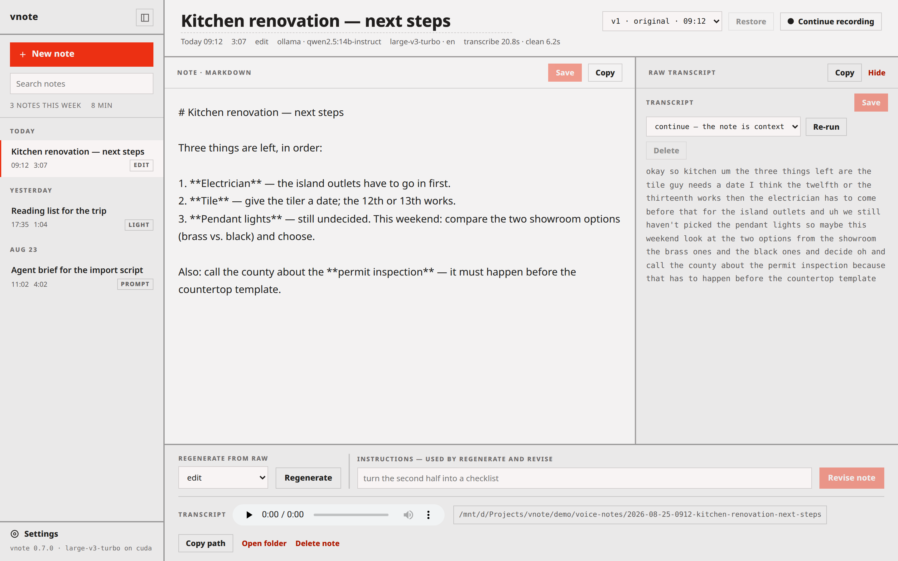

# vnote — local voice notes, on your own GPU

[](https://github.com/greenwoodms06/vnote/actions/workflows/ci.yml)
[](LICENSE)

Speak, and get clean Markdown back — transcribed locally with
[faster-whisper](https://github.com/SYSTRAN/faster-whisper) on your **GPU**, tidied by an LLM
(local [Ollama](https://ollama.com), or your Claude subscription), on your machine by default.
Two ways in:

- **Web UI** (recommended) — `vnote --serve --open` opens a page in your browser: record
  (pause and resume as you think), get the cleaned note with a **Copy** button, browse and
  play everything you've recorded, edit a note or regenerate / revise it, change settings.
- **CLI** — `vnote` records from the mic (Space pauses, Enter stops) or takes an audio file,
  and drops the note on your clipboard. Everything the web UI does is a flag here too.

> A personal tool I use daily, shared as-is — no support promised, but issues and PRs are welcome.
> On macOS and want polished point-and-talk? [yapper](https://github.com/ahmedlhanafy/yapper)
> or [local-whisper](https://github.com/luisalima/local-whisper) fit better.

## Platform support

| Route | Needs | Status |
|---|---|---|
| **Web UI** | a browser, and somewhere to run the daemon (Linux, WSL2, macOS, Windows) — the **browser owns the mic**, no audio setup | **primary — tested on WSL2 + a Windows browser** |
| CLI mic recording | WSL2 / Linux: `parec` (`pulseaudio-utils`) · native Windows / macOS: `sounddevice` | WSL2 + Linux tested; others best-effort |
| Audio files (`vnote memo.m4a`) | nothing extra | everywhere |

Transcription uses CUDA where it exists and falls back to CPU (macOS is CPU-only — slower, but it works).

<details>
<summary><b>macOS notes</b> — model choice, permissions, alternatives</summary>

CTranslate2 (faster-whisper's backend) has no Metal/MPS build, so transcription runs on
**CPU**. That is the one real ceiling on macOS — tools built on whisper.cpp do use Metal
and are markedly faster here. Apple Silicon is quick enough anyway, but the default
`large-v3-turbo` is the slowest option. Measured on an M-series Mac with the 11-second `.testdata/jfk.flac`, models
already downloaded:

| `VNOTE_WHISPER_MODEL` | time | notes |
|---|---|---|
| `base` | 1.3 s | fastest; fine for quick notes |
| `small` (default) | 2.8 s | good balance — the default |
| `large-v3-turbo` | 10.1 s | best accuracy; the right pick on CUDA |

`small` is the default for that reason — it keeps live transcription responsive on CPU. On a
CUDA box, where `large-v3-turbo` runs about realtime, prefer accuracy:

```bash
export VNOTE_WHISPER_MODEL=large-v3-turbo
```

Mic permissions depend on how you record:

- **Web UI** — the recording happens in your *browser*, so the Microphone grant goes to the
  browser, not to vnote (System Settings → Privacy & Security → Microphone, tick your browser;
  Safari/Chrome also ask on first record).
- **CLI** (`vnote` with no file argument) — the grant goes to the *terminal* that launches it.

That's all macOS needs installed — nothing else:

- **No audio tools.** Command-line mic capture uses `sounddevice` with its bundled PortAudio.
  `parec`/`pw-record` are WSL/Linux-only — don't install `pulseaudio-utils` here.
  A Homebrew `ffmpeg` on PATH is harmless: vnote ignores it for mic capture (its
  `-f pulse` input is Linux-only). Audio *files* (`vnote memo.m4a`) decode through
  faster-whisper's bundled ffmpeg, so no separate binary is needed either.
- **No CUDA noise.** CTranslate2 ships no macOS build, so vnote doesn't even probe
  CUDA on this platform — you never see "GPU init failed … not compiled with CUDA";
  `vnote --doctor`/`--config` just report CPU. (Off macOS the probe and its error
  still run, so a broken Linux CUDA stack stays loud.)
- **Always-on via LaunchAgent.** A ready-to-edit template ships at
  `scripts/com.vnote.daemon.plist` (run at login, restart on crash) — follow its
  header to set the absolute `PATH` (launchd runs with a minimal PATH, so the
  cleanup CLI like `opencode` and `~/.local/bin` must be added) and install with
  `launchctl bootstrap gui/$(id -u) ~/Library/LaunchAgents/com.vnote.daemon.plist`.
  Till then, run `vnote --serve` yourself or leave a terminal running it.

</details>

## Install

```bash
uv tool install git+https://github.com/greenwoodms06/vnote   # puts `vnote` on your PATH
```

You also need **a cleanup backend** — one of:

- **[Claude Code](https://claude.com/product/claude-code)** — best quality, uses your Claude
  subscription, no API key. Nothing to download.
- **[opencode](https://opencode.ai)** — reuses whatever provider you already set it up
  with (a local server, or a hosted provider). No extra key for vnote.
- **[Ollama](https://ollama.com)** — local, offline, free: `ollama pull qwen2.5:14b-instruct`
  (~10 GB VRAM; lighter options exist).

The first transcription downloads the Whisper model (~1.6 GB). Then `vnote --doctor` checks your
setup and names anything missing. (On WSL, **CLI** mic recording additionally needs
`sudo apt install -y pulseaudio-utils`; the web UI does not.)

<sub>Hacking on it? Clone and `uv sync && uv pip install -e .`, then run commands as
`uv run vnote …`. See the [User Guide](docs/USER_GUIDE.md#install-from-a-clone).</sub>

## Quickstart — Web UI

```bash
vnote --serve --open        # the page is up at once; the models warm in the background
```



- **Record** → talk → **Pause** / **Resume** (or Space) → **Stop**. With **Live transcript**
  on, the words appear as you speak and stay copyable — while paused, and while the note is
  being cleaned up after Stop. Pick the **style** (light / edit / summary / dictation /
  prompt / email / raw — or your own) and the backend per recording. Turn **Process on
  stop** off to get the raw transcript first, fix it, then **Regenerate**.
- The note appears with a **Copy** button; it is also saved under `voice-notes/`.
- **Notes**: every note you've made, newest first — play the audio, copy, **edit** the
  Markdown, edit the raw transcript, regenerate in another style or **revise** the note with
  an instruction ("make it shorter"); every change is a version you can restore.
  **Continue recording** adds a take to a note you already stopped; takes can be re-run,
  left out of a regenerate, or deleted. Deleting anything moves it to `voice-notes/trash/`.
- **Styles** are Markdown files — a few lines of front matter and the instruction the model
  gets. The built-ins ship with vnote; edit one in **Settings → Styles** and your copy lands in
  `~/.config/vnote/styles/`. The `prompt` style turns a spoken brief into a Claude Code
  session prompt and runs on the `claude-code` backend by default.
- **Settings**: every setting with a description, saved to `~/.config/vnote/config.json`
  (the CLI reads the same file), plus your custom vocabulary.
- **WSL2:** run the daemon in WSL and open the page in your Windows browser — `localhost` just
  works. Leave the daemon running (a systemd unit for Linux is in the
  [User Guide](docs/USER_GUIDE.md#warm-daemon)).

The page is served by the daemon itself — no build step, nothing else to install, and it
never talks to anything but `127.0.0.1`.

## Quickstart — CLI

```bash
vnote                  # record from the mic; Space pauses, Enter stops
vnote memo.m4a         # …or process an existing audio file
```

You get a cleaned note on your clipboard and saved under `voice-notes/`. The default cleanup
reorganizes into headings and lists; `--light` only fixes grammar and fillers, `--summary`
condenses, `--dictation` gives plain text with no title, `--raw` skips the LLM. Those are
just the built-in styles — a style is a Markdown file of instructions you can edit in the
web UI or add to; `--style NAME` picks any of them.
You can dictate formatting as you talk — *"make that a bulleted list"*, *"scratch that"* — and
the cleanup follows along. `--redo DIR --summary` re-cleans a saved note without
re-transcribing.

First run asks which cleanup backend to use and saves the choice (`vnote --setup` re-runs it;
the web UI's Settings page edits the same file). Override per run with `--backend`:

```bash
vnote --backend claude-code   # your Claude subscription (no API key)
vnote --backend opencode      # opencode's configured provider/model
vnote --backend ollama        # local and offline
vnote --backend claude        # Anthropic API, billed per token
```

Both CLI backends run with **every tool disabled** — cleanup is a pure text transform, so
the model gets no access to your files (opencode additionally runs in a scratch directory
rather than your current project). Details in the
[User Guide](docs/USER_GUIDE.md#the-opencode-backend).

See the [User Guide](docs/USER_GUIDE.md) for every flag.

## Output

Each note is a folder `voice-notes/YYYY-MM-DD-HHMM-<slug>/`:

| file | what |
|---|---|
| `audio.wav` / `audio.webm` | the recording (or a copy of the file you passed) |
| `transcript.txt` | raw Whisper output — editable from the web UI |
| `transcript.original.txt` | Whisper's output, kept once when you first edit the transcript |
| `note.md` | the cleaned note — the thing you keep |
| `meta.json` | model, durations, language, timestamps |
| `versions/note-<n>.md` | every version of the note (the current one included) — edits, regenerations, revisions — restorable from the web UI |
| `takes/<n>/` | once you continue a recording into the note, each take's own `audio.*` + `transcript.txt` (+ `transcript.original.txt`); the root `transcript.txt` becomes their join, rebuilt whenever a take is added, edited or deleted |

Deleting a note or a take **moves** it to `voice-notes/trash/` — nothing is ever unlinked.
vnote never empties the trash; that is your call, and restoring is a folder move back.

## Learn more

The **[User Guide](docs/USER_GUIDE.md)** covers everything this page leaves out: the web UI
page by page, the full CLI flag reference, the warm daemon and its HTTP API, custom vocabulary,
every setting and environment variable, and development/testing.

## License

[MIT](LICENSE) © Scott Greenwood
